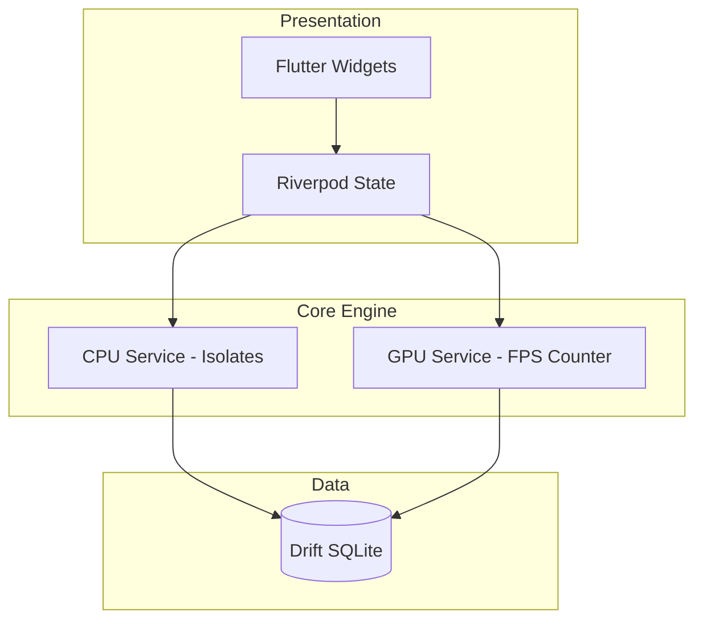

# Power BenchMark (DeviceCheck Pro) V1.0

[](https://github.com/HwanChoi/cpu_level_measure)
[](https://opensource.org/licenses/MIT)
[](https://flutter.dev/)
[](https://dart.dev/)

## 🚀 개요
**Power BenchMark (DeviceCheck Pro)**는 모바일 기기를 위해 설계된 고성능 벤치마킹 애플리케이션입니다. CPU와 GPU 성능을 빠르고 직관적으로 측정하여, 사용자와 개발자가 기기의 하드웨어 성능을 단 몇 초 만에 확인할 수 있도록 돕습니다.

> **"3번의 터치 이내에 성능 확인"** — 빠르고, 정확하며, 직관적인 벤치마크.

---

## ✨ 핵심 기능
- **CPU 벤치마크**: 소수 찾기 및 행렬 곱셈 알고리즘을 통해 싱글 코어 및 멀티 코어 성능을 측정합니다.
- **GPU 벤치마크**: 고성능 파티클 쉐이더 렌더링을 사용하여 실시간 FPS를 측정합니다.
- **기기 정보 확인**: OS 버전, 배터리 상태, DPI 등 상세 하드웨어 스펙을 한눈에 확인합니다.
- **히스토리 관리**: 측정 결과를 로컬 SQLite 데이터베이스에 자동으로 저장하여 이전 기록과 비교할 수 있습니다.
- **Isolate 기반 실행**: 무거운 연산은 백그라운드 Isolate에서 수행하여 벤치마크 중에도 부드러운 UI 경험을 유지합니다.

---

## 🛠 기술 스택
- **프레임워크**: [Flutter](https://flutter.dev/) (SDK ^3.10.0)
- **상태 관리**: [Riverpod](https://riverpod.dev/) (코드 생성 방식)
- **로컬 DB**: [Drift (SQLite)](https://drift.simonbinder.eu/)
- **데이터 모델링**: [Freezed](https://pub.dev/packages/freezed) & [JSON Serializable](https://pub.dev/packages/json_serializable)
- **디자인**: 미래지향적 다크 모드 UI (Black & Neon 포인트 컬러)

---

## 🏗 프로젝트 아키텍처
본 프로젝트는 확장성과 유지보수성을 위해 **Clean Architecture** 원칙을 따릅니다:

- **Presentation**: UI 위젯 및 Riverpod 상태 관리.
- **Domain**: 비즈니스 엔티티 및 요구사항 정의.
- **Data**: 저장소 구현, 데이터 소스 및 로컬 데이터베이스 관리.
- **Core Engine**: CPU/GPU 성능 엔진을 포함한 핵심 연산 레이어.



---

## 🏃 시작하기

### 사전 요구사항
- Flutter SDK (^3.10.0)
- Dart SDK
- Android SDK / Xcode (iOS용)

### 설치 방법
1. 저장소 클론:
   ```bash
   git clone https://github.com/your-repo/cpulevelmeasure.git
   ```
2. 의존성 설치:
   ```bash
   flutter pub get
   ```
3. 필수 코드 생성 (Riverpod, Drift, Freezed):
   ```bash
   flutter pub run build_runner build --delete-conflicting-outputs
   ```
4. 앱 실행:
   ```bash
   flutter run
   ```

---

## 🧪 테스트 및 분석
- **정적 분석**: `flutter analyze`
- **단위 테스트**: `flutter test`
- **릴리스 빌드**: `flutter build apk --release`

---

## 📝 라이선스
본 프로젝트는 **MIT 라이선스**를 따릅니다. 자세한 내용은 [LICENSE](LICENSE) 파일을 참조하세요.

---

## 👥 기여자
- **Hwan Choi Development Team**

---
<p align="center">
  Developed by <b>Coreline AI Dev Team</b>
</p>
